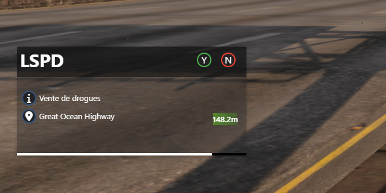
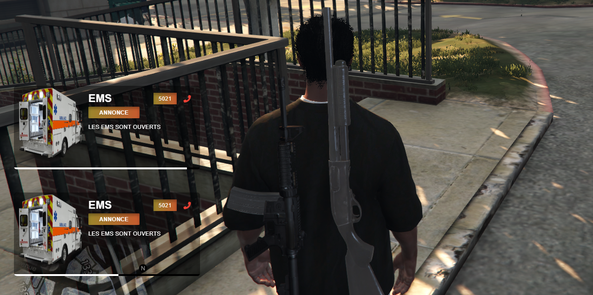

Notification System V1 — Documentation

Système complet de notifications pour FiveM incluant :
-  Notifications classiques
-  Alertes interactives (acceptation/refus)
-  Waypoint automatique sur acceptation
-  Annonces Job
-  Gestion des touches Y/N (Alert)
-  Interface NUI (React)
-  Exports utilisables par d'autres scripts

FONCTIONNALITÉS

1) Notifications classiques
- Icône personnalisée (FontAwesome)
- Texte + couleur
- Timer automatique
- Animation d’apparition/disparition

2) Alertes interactives
- Job
- Texte
- Localisation (nom de rue)
- Distance dynamique (ex: 120.5m)
- Coordonnées exactes
- Interaction Y/N
- Waypoint automatique sur acceptation

3)  Annonces Job
- Job + logo
- Type d’annonce
- Couleur personnalisée
- Message + numéro

4) Waypoint automatique
- Sur acceptation d’une alerte
- Utilise SetNewWaypoint

5) Exports utilisables (Client side)
- AddNotificationBasic
- AddAlert
- AddAnnounce

ÉVÉNEMENTS DISPONIBLES

 Envoyer une annonce :
TriggerClientEvent("so_notifs:SendAnnounce", job, jobLogo, type, color, message, numero)

Envoyer une notification :
TriggerClientEvent("so_notifs:SendDefaultNotification", source, icon, message, color, duration)

EXPORTS DISPONIBLES

 Ajouter une notification classique :
exports.so_notifs:AddNotificationBasic(icon, text, color)

Ajouter une alerte :
exports.so_notifs:AddAlert({
    job = "LSPD",
    text = "Vente de drogues",
    location = "Great Ocean Highway",
    coords = { x, y, z },
    distance = "120m",
    top = 500,
    left = 30
})

Ajouter une annonce :
exports.so_notifs:AddAnnounce(job, jobLogo, type, color, message, numero)

 COMMANDES DE TEST

/alert  
→ Affiche une alerte avec distance dynamique et coords.

/notify icon text color  
Exemple :  
/notify fa-solid fa-bell "Test" red

/CreateAnnounce job type color message numero  
Exemple :  
/CreateAnnounce LSPD Annonce blue "Message" 911

 KEYMAPPING

Y → Accepter une alerte  
N → Refuser une alerte  

 EXPORTS 

exports("AddAnnounce", AddAnnounce)  
exports("AddAlert", AddAlert)  
exports("AddNotificationBasic", AddNotificationBasic)

